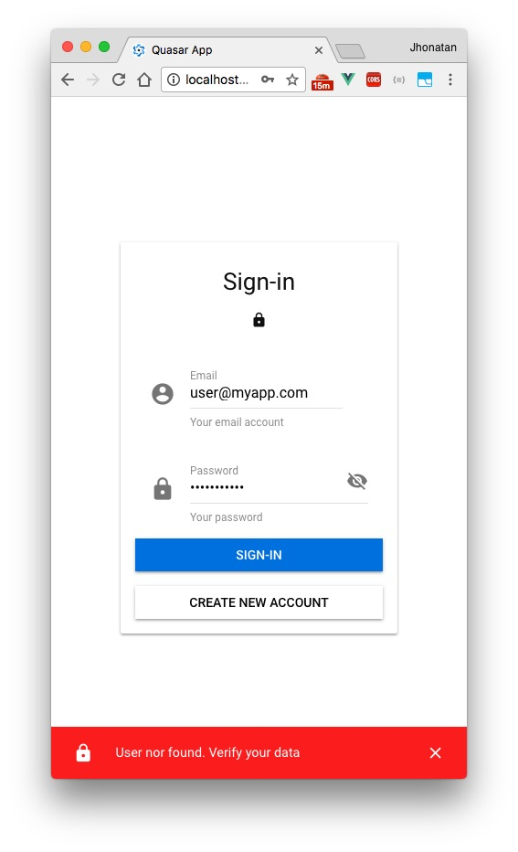
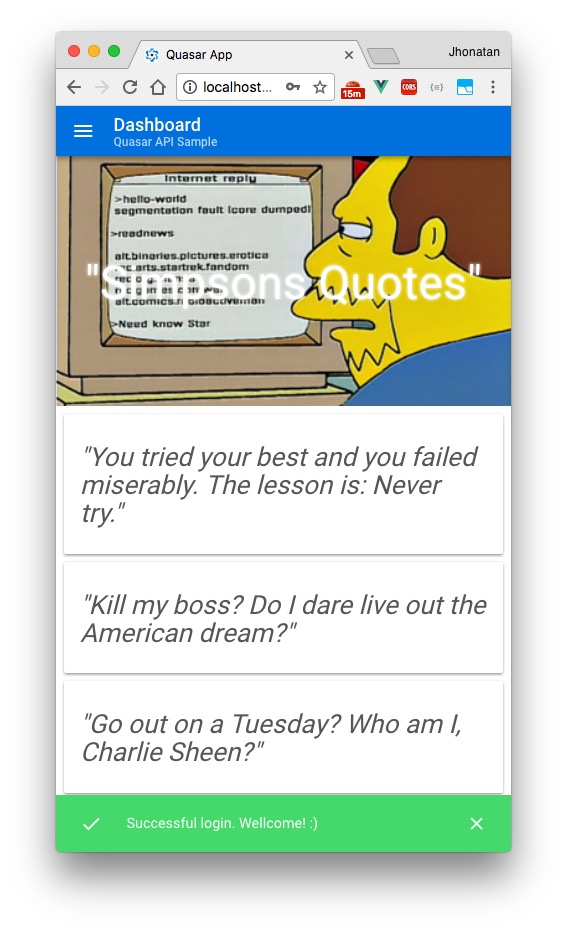
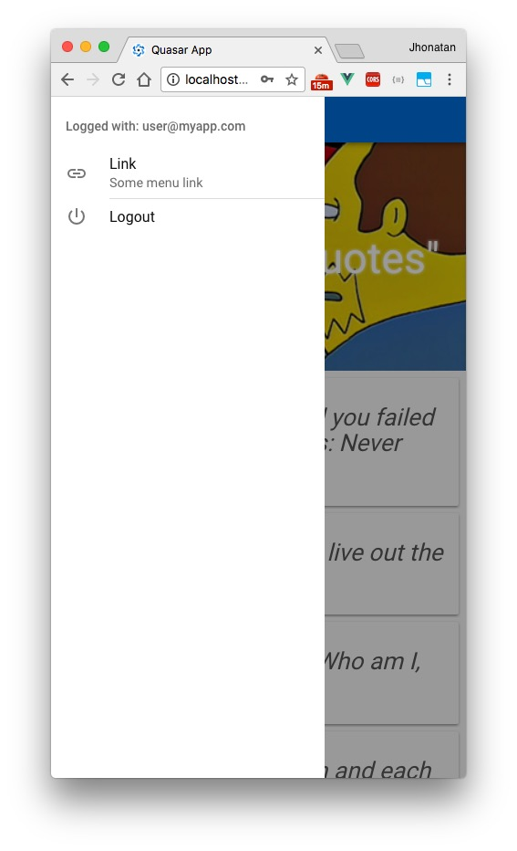
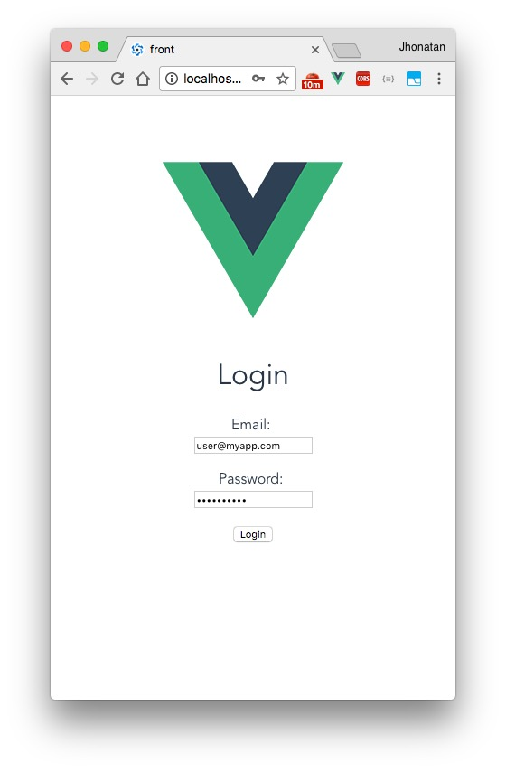
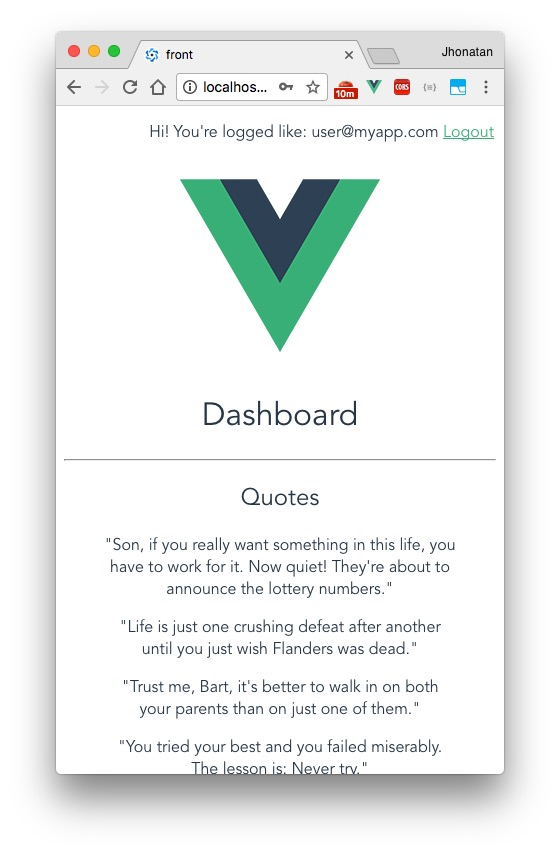

# Simple Vuejs+Quasar client for Rails backend API.

> An simple start kit client for my minimalist rails API projects with Vuejs 2.

## ScreenShots:
### Quasar:
<a href="screenshots/quasar1.jpg"></a>
<a href="screenshots/quasar2.jpg"></a>
<a href="screenshots/quasar3.jpg"></a>

### Vuejs:
<a href="screenshots/vuejs1.jpg"></a>
<a href="screenshots/vuejs2.jpg"></a>

## Vuejs/Quasar setup:

### Approaches

- Requests, responses interceptors (axios)
- Auth Token with localStorage
- Vuex to store current user

#### Libs

- [Axios](https://github.com/axios/axios)
- [Vuex](https://vuex.vuejs.org/en/)
- [VueRouter](https://router.vuejs.org/en/)

##### Build Setup

```bash
# install dependencies
npm install

# serve with hot reload at localhost:8080 Vuejs
npm run dev

# serve with hot reload at localhost:8080 Quasar
quasar dev

# build for production with minification
npm run build

# build for production and view the bundle analyzer report
npm run build --report
```

## Rails setup:

### Approaches

- API versioning (api/v1)
- Auth Token with expiration pediod (knock)
- Cors control (rack-cors)
- Protect for attacks (rack-attack)

#### Libs

- [knock](https://github.com/nsarno/knock)
- [rack-cors](https://github.com/cyu/rack-cors)
- [rack-attack](https://github.com/kickstarter/rack-attack)


##### Build Setup

```bash
# Configure in config/initializers
rack-attack.rb, cors.rb, knock.rb

# Create database
rake db:craete

# Migrate database
rake db:migrate

# Start server
rails server
```
